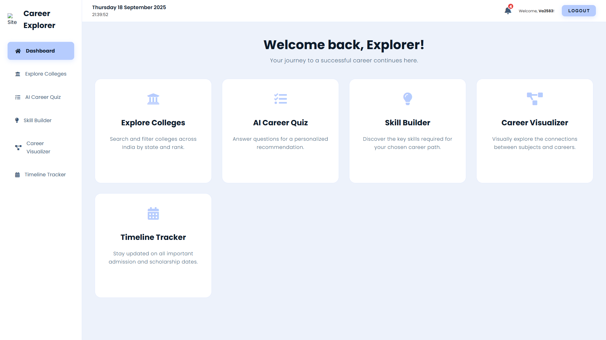
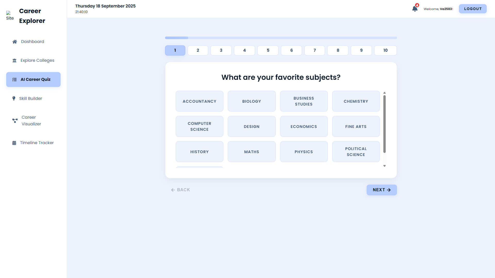
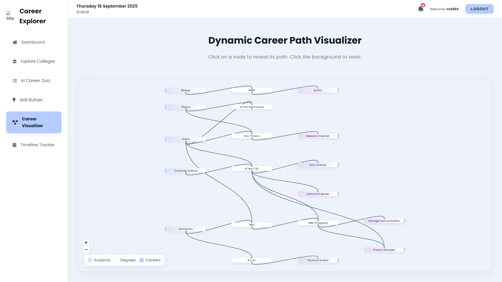
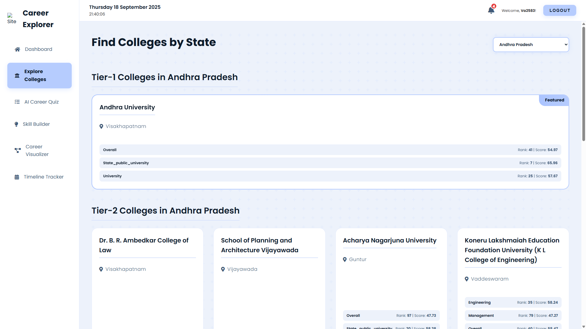
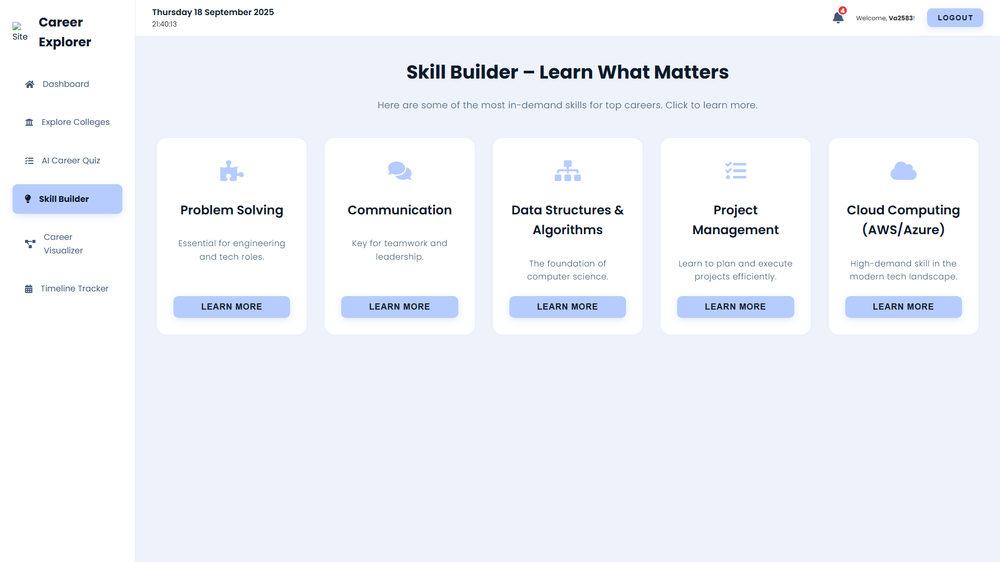
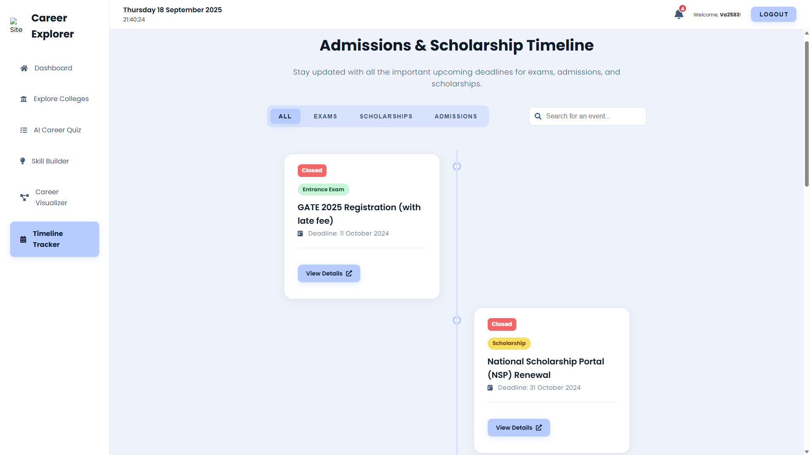

# 🤖 CAPE — Career Path Explorer

<p align="center">
  
</p>

<p align="center">
  <a href="#"></a>
  <a href="#"></a>
  <a href="#"></a>
</p>

A compact, explainable career recommendation engine that maps student profiles (skills, education, interests) to ranked career suggestions. Focused on reproducible ML pipelines and an interactive frontend for exploration.

---

## Contents
- [Highlights](#highlights)
- [Quick preview](#quick-preview)
- [Project layout](#project-layout)
- [Quickstart (Windows)](#quickstart-windows)
- [Contributing & License](#contributing--license)

---

## 🚀 Highlights
- Explainable Random Forest with feature importance and visualizer.
- End-to-end pipeline: raw data → preprocessing → features → training → inference.
- Quiz micro-app for candidate profiling and personalized recommendations.
- Web frontend (Vite/React) for interactive exploration.

---

## 🖼️ Quick preview

<div align="center" style="display:flex;flex-wrap:wrap;gap:18px;justify-content:center;max-width:1200px;margin:0 auto;">

  <figure style="width:320px;margin:0;text-align:center;font-family:system-ui,Segoe UI,Helvetica,Arial,sans-serif;">
    <a href="./screenshots/Dashboard.png" style="display:block;text-decoration:none;color:inherit;">
      
    </a>
    <figcaption style="font-size:13px;color:#556;line-height:1.2;margin-top:8px;">Dashboard — Top career recommendations</figcaption>
  </figure>

  <figure style="width:320px;margin:0;text-align:center;font-family:system-ui,Segoe UI,Helvetica,Arial,sans-serif;">
    <a href="./screenshots/Quiz.png" style="display:block;text-decoration:none;color:inherit;">
      
    </a>
    <figcaption style="font-size:13px;color:#556;line-height:1.2;margin-top:8px;">Quiz — Skill & interest assessment</figcaption>
  </figure>

  <figure style="width:320px;margin:0;text-align:center;font-family:system-ui,Segoe UI,Helvetica,Arial,sans-serif;">
    <a href="./screenshots/Visualizer.png" style="display:block;text-decoration:none;color:inherit;">
      
    </a>
    <figcaption style="font-size:13px;color:#556;line-height:1.2;margin-top:8px;">Visualizer — Feature importance & insights</figcaption>
  </figure>

  <figure style="width:320px;margin:0;text-align:center;font-family:system-ui,Segoe UI,Helvetica,Arial,sans-serif;">
    <a href="./screenshots/CollegeExplorer.png" style="display:block;text-decoration:none;color:inherit;">
      
    </a>
    <figcaption style="font-size:13px;color:#556;line-height:1.2;margin-top:8px;">College Explorer — Program & college details</figcaption>
  </figure>

  <figure style="width:320px;margin:0;text-align:center;font-family:system-ui,Segoe UI,Helvetica,Arial,sans-serif;">
    <a href="./screenshots/SkillBuilder.png" style="display:block;text-decoration:none;color:inherit;">
      
    </a>
    <figcaption style="font-size:13px;color:#556;line-height:1.2;margin-top:8px;">Skill Builder — Learning path suggestions</figcaption>
  </figure>

  <figure style="width:320px;margin:0;text-align:center;font-family:system-ui,Segoe UI,Helvetica,Arial,sans-serif;">
    <a href="./screenshots/TimelineTracker.png" style="display:block;text-decoration:none;color:inherit;">
      
    </a>
    <figcaption style="font-size:13px;color:#556;line-height:1.2;margin-top:8px;">Timeline Tracker — Progress & milestones</figcaption>
  </figure>

  <figure style="width:320px;margin:0;text-align:center;font-family:system-ui,Segoe UI,Helvetica,Arial,sans-serif;">
    <a href="./screenshots/feature_importance.png" style="display:block;text-decoration:none;color:inherit;">
      
    </a>
    <figcaption style="font-size:13px;color:#556;line-height:1.2;margin-top:8px;">Feature importance — Model explainability</figcaption>
  </figure>

</div>

<p style="text-align:center;font-size:13px;color:#666;margin-top:12px;">
  Tip: click any thumbnail to open the full-size image. Images are shown from <code>./screenshots/</code>.
</p>

---

## 📁 Project layout

```
.vscode/                     - editor settings
backend/                     - Python backend, datasets and model artifacts
  ├── datasets/              - many CSVs (College.csv, Engineering.csv, ... )
  ├── app.py                 - backend app / demo scripts
  ├── merge_colleges.py
  ├── check_model_shapes.py
  ├── app.db                 - small demo DB (if present)
  ├── career_1200_model.pkl
  ├── quiz_label_encoder.pkl
  ├── quiz_vectorizer.pkl
  └── requirements.txt
frontend/                    - Vite/React app (UI)
  ├── public/
  ├── src/
  ├── package.json
  └── README.md
quiz/                        - quiz micro-app & quiz-specific models
  ├── models/                - emb_model, tfidf_vectorizer.joblib, voting_clf.joblib, label_encoder.joblib
  ├── app.py
  └── career_quiz_dataset_1200.csv
screenshots/                 - images used in README (Dashboard.png, Quiz.png, Visualizer.png, ...)
notebooks/                   - EDA, experiments and visualizations
README.md                    - this file
requirements.txt             - root or backend Python deps
LICENSE                      - MIT
```

(Structure reflects current workspace — files like career_model.pkl, scaler.pkl, colleges.csv are in root/backend as shown.)

---

## ⚙️ Quickstart (Windows)
1. Clone:
   git clone https://github.com/<your-org>/Career-Path-Explorer.git
2. Create & activate venv (PowerShell):
   ```
   python -m venv .venv
   .\.venv\Scripts\Activate.ps1
   ```
3. Install:
   ```
   pip install -r backend/requirements.txt
   ```
4. Run backend demo:
   ```
   python backend/app.py
   ```
5. Run frontend (from frontend/):
   ```
   cd frontend
   npm install
   npm run dev
   ```

---

## 🤝 Contributing & License
- Contributions welcome — open issues or PRs.
- Follow code style and add tests for new features.
- Licensed under MIT — see LICENSE.

---
